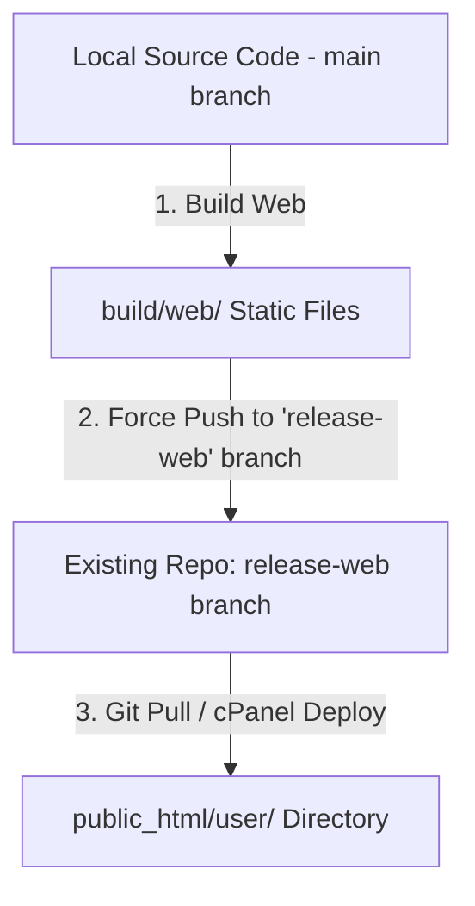

# Git-Based Deployment Guide: Hosting Flutter Web on Shared Hosting

This guide outlines the step-by-step procedure to build, push via Git, and deploy your Flutter Web application to **`https://warehouse.maxmar.net/user`**.

---

## Deployment Strategy: Using your existing `flutter_warehouse` Repository

Instead of creating a new repository, we will use your existing **`flutter_warehouse`** repository but push the compiled static web files to a dedicated branch named **`release-web`**. 

This keeps your source code secure (it won't sit in the public web root) and avoids bloating your main development branch's Git history.



---

## Step 1: Pre-Deployment Verification

1. Open [app_config.dart](file:///c:/Projects/flutter_warehouse/lib/core/config/app_config.dart).
2. Verify the production API endpoint on line 26 points to your production server:
   ```dart
   static const String prodBaseUrl = 'https://warehouse.maxmar.net/api/v1/';
   ```

---

## Step 2: Create the Automation Script (Local)

Create a deployment script named `deploy.ps1` in your **root project directory** (`c:\Projects\flutter_warehouse\deploy.ps1`). This script compiles your web application, creates the `.htaccess` file, and pushes the build output directly to the `release-web` branch of your existing repository.

### PowerShell Script (`deploy.ps1`):
```powershell
# 1. Build the Flutter web app for production
Write-Host "Building Flutter Web application..." -ForegroundColor Green
flutter build web --release -t lib/main_production.dart --base-href="/user/" --dart-define=APP_ENV=production

# 2. Navigate to the build output
cd build/web

# 3. Create .htaccess file if it doesn't exist
if (-not (Test-Path .htaccess)) {
    @'
<IfModule mod_rewrite.c>
  RewriteEngine On
  RewriteBase /user/
  RewriteRule ^index\.html$ - [L]
  RewriteCond %{REQUEST_FILENAME} !-f
  RewriteCond %{REQUEST_FILENAME} !-d
  RewriteRule . /user/index.html [L]
</IfModule>
'@ | Out-File -FilePath .htaccess -Encoding ascii
}

# 4. Initialize temporary Git repo in the build folder and push to release-web
git init
git checkout -b release-web
git remote add origin <YOUR_EXISTING_REPO_GIT_URL>
git add .
git commit -m "Deploy update: $(Get-Date -Format 'yyyy-MM-dd HH:mm:ss')"
git push origin release-web -f

# 5. Return to project root
cd ../..
Write-Host "Build pushed successfully to branch 'release-web'! Now pull on your server." -ForegroundColor Green
```
*Note: Replace `<YOUR_EXISTING_REPO_GIT_URL>` with your repository's URL (e.g. `https://github.com/aswinadi/flutter_warehouse.git`).*

---

## Step 3: Setup Git Pull on your Shared Hosting

Now, configure your shared hosting server to pull only the `release-web` branch into the `user` folder.

### Option A: Using SSH (Recommended)
1. SSH into your shared hosting server.
2. Navigate to your website's root directory:
   ```bash
   cd public_html
   ```
3. Clone **only** the `release-web` branch from your existing repository into a new folder named `user`:
   ```bash
   git clone -b release-web --single-branch <YOUR_EXISTING_REPO_GIT_URL> user
   ```
   *This downloads only the compiled files into `public_html/user/` without fetching your raw source code files.*

### Option B: Using cPanel Git Version Control
1. Log in to cPanel and open **Git Version Control**.
2. Click **Create**.
3. Fill in the details:
   * **Clone URL:** `<YOUR_EXISTING_REPO_GIT_URL>`
   * **Branch:** `release-web`
   * **File Path:** `public_html/user`
   * **Repository Name:** `warehouse-web-release`
4. Click **Create**.

---

## Step 4: How to Deploy Updates in the Future

Once this setup is completed, deploying updates requires only two steps:

1. **On your local machine:**
   Run your deployment script:
   ```powershell
   ./deploy.ps1
   ```
2. **On your shared hosting server:**
   * **If using SSH:**
     ```bash
     cd public_html/user
     git pull origin release-web
     ```
   * **If using cPanel:**
     Go to **Git Version Control**, select the repository, and click **Pull or Deploy** -> **Update from Remote**.
