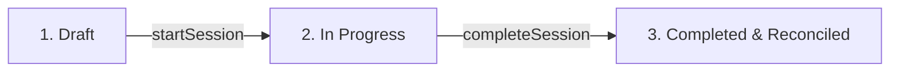

# Stock Opname Module Documentation

This document describes the design, business logic lifecycle, API integration, and UI layouts for the **Stock Opname** (Physical Inventory Count) module in the Maxmar Warehouse Flutter app and Laravel backend API.

---

## 1. Business Logic Lifecycle

A stock opname session helps warehouse managers audit physical stock levels and reconcile discrepancies. The session transitions through three states:

1. **Draft**:
   - Created by selecting a target warehouse and adding optional notes.
   - No inventory snapshot is taken yet.
2. **In Progress**:
   - The counting session is activated on the backend.
   - The system takes a snapshot of all available inventory in the warehouse (`system_qty`) and initializes all `counted_qty` values to `0`.
   - Field operators use the mobile/desktop app to scan barcode SKU tags and enter physical counts.
3. **Completed**:
   - Authorized users finalize the opname session.
   - Discrepancy is calculated as: `discrepancy = counted_qty - system_qty`.
   - Inventory levels are updated, and transaction logs (`InventoryTransaction` with type `adjust`) are recorded on the backend.

---

## 2. API Integration

The mobile/desktop client integrates with the following backend routes (`wh` prefix):

* **List Active Sessions**: `GET /api/v1/wh/stock-opname`
* **Create Session**: `POST /api/v1/wh/stock-opname` (Payload: `warehouse_id`, `notes`)
* **Start Session**: `POST /api/v1/wh/stock-opname/{id}/start` (Transitions status to `in_progress` and snapshots inventories)
* **Lookup Barcode**: `POST /api/v1/wh/barcodes/scan` (Payload: `barcode_code`) - retrieves product metadata (name, SKU, unit)
* **Submit Scan Count**: `POST /api/v1/wh/stock-opname/{id}/scan` (Payload: `barcode`, `qty`)
* **Get Session Summary**: `GET /api/v1/wh/stock-opname/{id}/summary` - returns the checklist of items, system qty, counted qty, and discrepancies
* **Complete Session**: `POST /api/v1/wh/stock-opname/{id}/complete` (Finalizes the audit and updates database counts)

---

## 3. UI/UX Design

The module is built with an **Adaptive Layout** to deliver a premium experience across platforms:

### 3.1. Desktop & Tablet (Split-Pane View)
Activated on screens wider than 900px:
* **Left Pane (55% width)**: Shows the current items checklist with discrepancy counters, system quantities, and counted quantities. Features a search bar to filter items by SKU or product name.
* **Right Pane (45% width)**: Integrates the live camera viewfinder scanner (using the `MobileScanner` library) and a manual lookup fallback input field.

### 3.2. Mobile (Portrait View)
Optimized for single-hand scanning:
* Shows the list of items in the session with indicators showing which items have discrepancies.
* Tapping a floating barcode button opens a full-screen bottom sheet with the camera scanner.
* Tapping any item directly in the list opens the count adjustment dialog.

### 3.3. "Barcode-First" Keypad Overlay
Since barcodes represent item SKUs rather than unique serial numbers, scanning a barcode does not blindly increment the count by 1. Instead:
1. Scanning a barcode triggers a quick lookup to identify the product.
2. An overlay is displayed showing the product's name, SKU, and unit.
3. A custom, touch-friendly **numeric keypad** (keys `0-9`, `.`, `Backspace`, `Clear`, `+1`, `-1`) allows the operator to enter or adjust the total counted quantity with ease.
