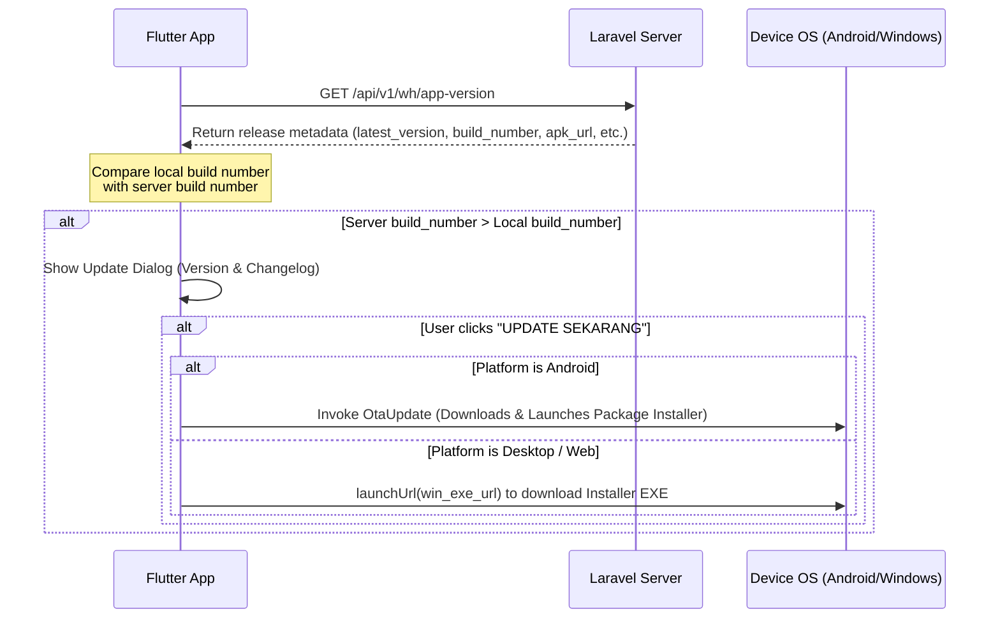

# Self-Hosted In-App Auto-Update System

The application features an integrated, self-hosted auto-update system that automatically prompts users to update the application when a new build is deployed to the production environment.

## Overview
The update system uses a hybrid strategy tailored to each target platform:
- **Android**: Downloads the APK file in the background (showing download progress notifications) and launches the native package installer directly from the app.
- **Desktop (Windows/macOS)** & **Web**: Prompts the user to update and opens the browser/download client pointing to the latest desktop installer setup executable (e.g. `setup.exe`).

---

## 1. How It Works



---

## 2. Server-Side API Specification
The auto-updater queries the server endpoint `GET /api/v1/wh/app-version` (or configured baseUrl in Dio client). The endpoint must return the following JSON response:

```json
{
  "latest_version": "1.2.0",
  "build_number": 2,
  "apk_url": "https://warehouse.maxmar.net/downloads/maxmar_warehouse.apk",
  "win_exe_url": "https://warehouse.maxmar.net/downloads/maxmar_warehouse_setup.exe",
  "release_notes": "- Memperbaiki crash dropdown Stock Mutation.\n- Memperbaiki scanner QR code dengan prefix URL.\n- Menambahkan sistem auto-update."
}
```

### Hosting the Files:
- Upload your production Android APK to the shared hosting public directory as specified in the `apk_url` field (e.g., `public/downloads/maxmar_warehouse.apk`).
- Upload the Windows installer setup to the public directory as specified in the `win_exe_url` field.

---

## 3. Flutter Integration Details

### Dependencies (`pubspec.yaml`):
- `package_info_plus`: Reads the current running application version and build number.
- `ota_update`: Orchestrates downloading files and prompting Android's Package Installer.
- `url_launcher`: Opens download links on desktop and web environments.

### Service File:
- Located at [updater_service.dart](file:///c:/Projects/flutter_warehouse/lib/core/services/updater_service.dart).

### Dialog Trigger:
- Initialized in [main_shell.dart](file:///c:/Projects/flutter_warehouse/lib/core/widgets/main_shell.dart) on widget layout compilation immediately following successful user authentication.

---

## 4. Platform-Specific Configurations

### Android
On Android Oreo (API 26) and above, installing apps downloaded outside the Google Play Store requires the **"Install unknown apps"** permission.
- The `ota_update` package handles generating the local secure file provider and prompting the user to grant this permission if not already enabled for `com.maxmar.warehouse`.
- Once permission is granted, the app automatically transitions to the install execution prompt.

### Windows (Desktop)
1. **Running Processes**: Windows lock-locks executables that are currently running. Directly overwriting `flutter_app.exe` in the background will fail.
2. **Installer Flow**: By distributing a Windows Setup Installer (e.g., built using Inno Setup or NSIS):
   - The installer checks if the application is currently running.
   - If running, it closes or prompts the user to close the app.
   - It overwrites the files in the target directory (e.g., `C:\Program Files\` or local `AppData`) and completes the update.
